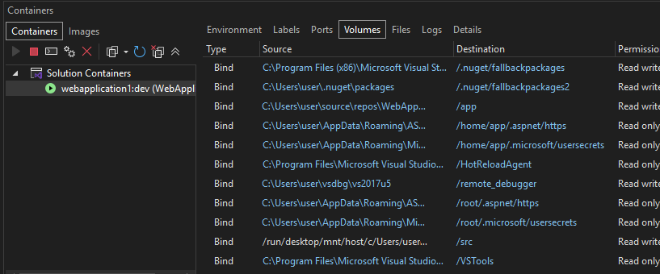
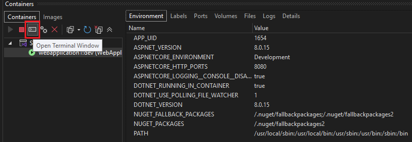
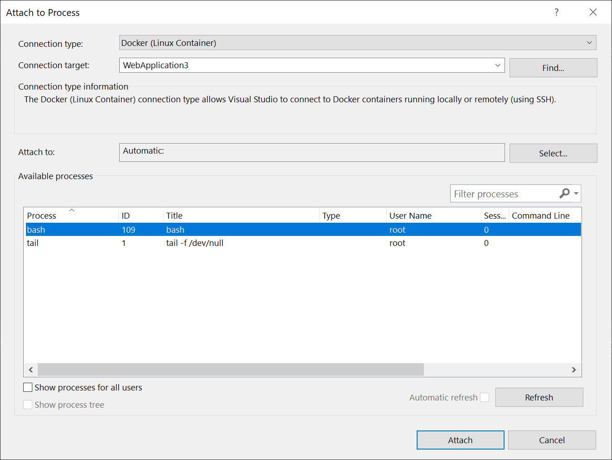
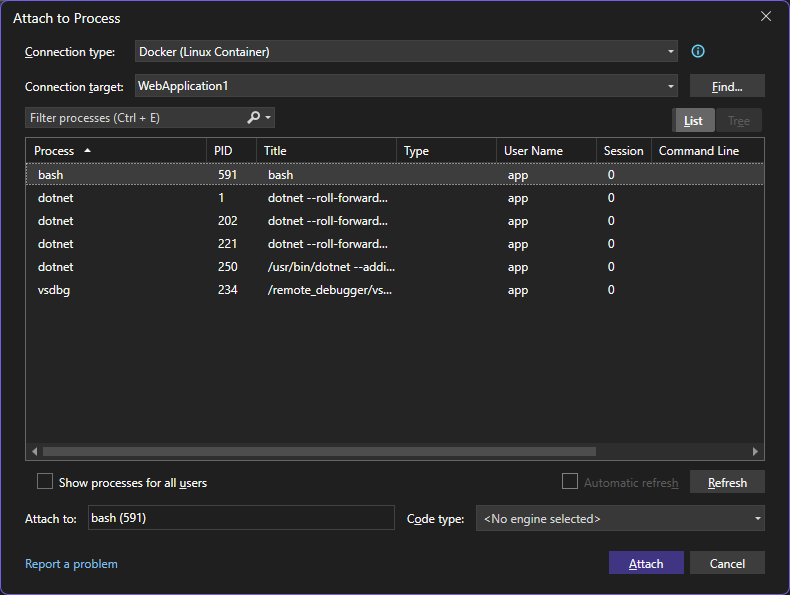
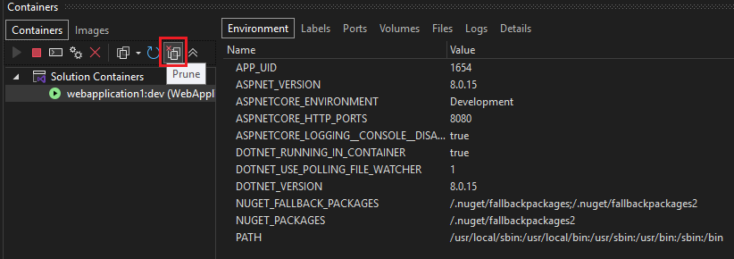

# Use the Containers window

You can use the Visual Studio **Containers** window to see what's going on inside the containers that host your apps and to view your container images. If you're used to running Docker commands to view and analyze your containers, this window provides a convenient way to monitor and interact with containers without leaving the Visual Studio IDE.

## Prerequisites

:::moniker range="vs-2019"

- [Docker Desktop](https://hub.docker.com/editions/community/docker-ce-desktop-windows)
- [Visual Studio 2019 version 16.4](https://visualstudio.microsoft.com/downloads/?cid=learn-onpage-download-cta) or later.

:::moniker-end
:::moniker range="vs-2022"

- [Docker Desktop](https://hub.docker.com/editions/community/docker-ce-desktop-windows)
- [Visual Studio](https://visualstudio.microsoft.com/downloads/?cid=learn-onpage-download-cta)
- For the Docker Compose node:
  - [Visual Studio 2022 version 17.7 or later](https://visualstudio.microsoft.com/downloads/?cid=learn-onpage-download-cta)
  - Docker v2, which installs with Docker Desktop and is on by default.

:::moniker-end
:::moniker range="visualstudio"

- [Docker Desktop](https://hub.docker.com/editions/community/docker-ce-desktop-windows) or [Podman Desktop](https://podman-desktop.io/downloads).
- [Visual Studio](https://visualstudio.microsoft.com/downloads/?cid=learn-onpage-download-cta). For Podman support, [Visual Studio (Insiders)](https://visualstudio.microsoft.com/insiders?cid=learn-onpage-download-cta).
- For the Docker Compose node:
  - Docker v2, which installs with Docker Desktop and is on by default.

:::moniker-end

## View information about your containers

:::moniker range="vs-2019"

The **Containers** window opens automatically when you start a containerized .NET project. To open the **Containers** window any time, select **View** > **Other Windows** > **Containers** from the Visual Studio menu. You can also use **Ctrl**+**Q** to open the Visual Studio Search box, type *Containers*, and select the **Containers** item.

The left side of the window shows the list of containers on your local machine. The containers associated with your current solution are under **Solution Containers**. On the right is a pane with tabs for **Environment**, **Labels**, **Ports**, **Volumes**, **Files**, and **Logs**.

:::moniker-end
:::moniker range="vs-2022"

The **Containers** window opens automatically when you start a containerized .NET project. To open the **Containers** window any time, select **View** > **Other Windows** > **Containers** from the Visual Studio menu, or press **Ctrl**+**K**, **Ctrl**+**O**. You can also use **Ctrl**+**Q** to open the Visual Studio Search box, type *Containers*, and select the **Containers** item.

The left side of the window shows the list of containers on your local machine. The containers associated with your current solution are under **Solution Containers**. On the right is a pane with tabs for **Environment**, **Labels**, **Ports**, **Volumes**, **Files**, **Logs**, and **Details**.

If you're using Docker Compose and Visual Studio 2022 version 17.7 or later, you see a tree of nodes, with a parent node for your solution and child nodes for each project enrolled in Docker Compose.

:::moniker-end
:::moniker range="visualstudio"

The **Containers** window opens automatically when you start a containerized .NET project. To open the **Containers** window any time, select **View** > **Other Windows** > **Containers** from the Visual Studio menu, or press **Ctrl**+**K**, **Ctrl**+**O**. You can also use **Ctrl**+**Q** to open the Visual Studio Search box, type *Containers*, and select the **Containers** item.

The left side of the window shows the list of containers on your local machine. The containers associated with your current solution are under **Solution Containers**. On the right is a pane with tabs for **Environment**, **Labels**, **Ports**, **Volumes**, **Files**, **Logs**, and **Details**.

If you're using Docker Compose, you see a tree of nodes, with a parent node for your solution and child nodes for each project enrolled in Docker Compose.

:::moniker-end

> [!TIP]
> By default, the **Containers** window is docked with the **Watch** window when the debugger is running. You can easily customize where the **Containers** tool window is docked. See [Customizing window layouts in Visual Studio](../ide/customizing-window-layouts-in-visual-studio.md).

### View environment variables

The **Environment** tab shows the environment variables in the container. You can set these variables in the Dockerfile, in an *.env* file, or by using the `-e` option when you start a container using a Docker command.

> [!NOTE]
> Changes to the environment variables aren't reflected in real time. Also, the environment variables in this tab are the system environment variables on the container, not the user environment variables local to the app.

:::moniker range="vs-2019"

:::moniker-end
:::moniker range=">=vs-2022"

:::moniker-end

### View labels

The **Labels** tab shows the labels for the container. Labels are a way of setting custom metadata on Docker objects. Visual Studio sets some labels automatically.

:::moniker range="vs-2019"

:::moniker-end
:::moniker range=">=vs-2022"

:::moniker-end

### View port mappings

On the **Ports** tab, you can check the port mappings for your container. Well-known ports are linked, so you can select the link to open a browser to the host port address.

:::moniker range="vs-2019"

:::moniker-end
:::moniker range=">=vs-2022"

:::moniker-end

### View volumes

The **Volumes** tab shows the mounted filesystem nodes, or *volumes*, on the container.

:::moniker range="vs-2019"

:::moniker-end
:::moniker range=">=vs-2022"

:::moniker-end

### View the filesystem

On the **Files** tab, you can view the container's filesystem, including the app folder that contains your project. By using the **Files** tab, you can view application logs such as Internet Information Services (IIS) logs, configuration files, and other content files in your container's filesystem.

:::moniker range="vs-2019"

:::moniker-end
:::moniker range=">=vs-2022"

>[!NOTE]
>In Visual Studio 2022 version 17.7 or later, when targeting .NET 8 or later, the Dockerfile might contain the  `USER app` command, which specifies to run the app with regular user permissions. The **Files** tab uses the same permissions, so you might not be able to view folders that require elevated permissions to view.

:::moniker-end

To open a file in Visual Studio, double-click the file or right-click it and choose **Open**. Visual Studio opens the file in read-only mode.

:::moniker range="vs-2019"

:::moniker-end
:::moniker range=">=vs-2022"

:::moniker-end

### View logs

The **Logs** tab shows the results of the `docker logs` command. By default, the tab shows `stdout` and `stderr` streams on a container, but you can configure the output. For details, see [Docker logging](https://docs.docker.com/config/containers/logging/).

:::moniker range="vs-2019"

By default, the **Logs** tab streams the logs. You can pause the stream by selecting the **Stream Logs** button on the tab. Select **Stream Logs** again to resume the streaming from where it left off.

:::moniker-end
:::moniker range=">=vs-2022"

By default, the **Logs** tab streams the logs. You can pause the stream by selecting the **Stream** button on the tab. Select **Stream** again to resume the streaming from where it left off.

:::moniker-end

To clear the logs, use the **Clear** button on the **Logs** tab. To get all the logs, use the **Refresh** button.

> [!NOTE]
> Visual Studio automatically redirects `stdout` and `stderr` to the **Output** window when you run Windows containers without debugging. These logs then don't display in the **Logs** tab.

:::moniker range=">=vs-2022"
If you're using Docker Compose with Visual Studio 2022 version 17.7 or later, you can view logs of each container separately or interleaved into a single output stream. If you select the parent node for the solution, you see interleaved logs from all the Compose projects. The first column on each line shows the container that produced that line of output. If you only want to see the logs for one container, select that project's node.

### View details

The **Details** tab displays metadata and runtime information about the container's configuration in JSON format. This information includes environment variables, ports, volumes, and other runtime settings.

:::moniker-end

## Interact with containers

The confirmation dialogs for various tasks, such as removing containers and images or launching more than 10 containers at a time, might display prompts. You can disable each prompt by using the checkbox on the dialog window.

:::moniker range="vs-2019"

You can also enable or disable these options by using the settings at **Tools** > **Options** > **Container Tools** > **Containers Tool Window**. For more information, see [Configure Container Tools](container-tools-configure.md).

:::moniker-end
:::moniker range="vs-2022"

You can also enable or disable these options by using the settings at **Tools** > **Options** > **Container Tools** > **Containers Window**. For more information, see [Configure Container Tools](container-tools-configure.md).

:::moniker-end
:::moniker range="visualstudio"

You can also enable or disable these options by using the settings in the **Tools** > **Options** pane under **All Settings** > **Container Tools** > **Containers Window**. For more information, see [Configure Container Tools](container-tools-configure.md).

:::moniker-end

### Start, stop, and remove containers

By default, the **Containers** window shows all containers on the machine that Docker manages. You can use the toolbar buttons in the **Containers** window to start, stop, or delete a container. The containers list dynamically updates as containers are created or removed.

To select multiple containers, for example to remove more than one container at a time, use **Ctrl**+**Select**. You're prompted to confirm if you try to start or remove more than 10 containers at a time. You can disable the confirmation prompts if desired.

### Open a terminal window in a running container

You can open a terminal window (command prompt or interactive shell) in the container by using the **Open Terminal Window** button in the **Containers** window.

:::moniker range="vs-2019"

:::moniker-end
:::moniker range=">=vs-2022"

:::moniker-end

For Windows containers, the Windows command prompt opens. For Linux containers, a window opens using the Bash shell.

:::moniker range="vs-2019"

Normally, the terminal window opens outside Visual Studio as a separate window. If you want a command-line environment integrated into the Visual Studio IDE as a dockable tool window, you can install [Whack Whack Terminal](https://marketplace.visualstudio.com/items?itemName=DanielGriffen.WhackWhackTerminal).

:::moniker-end
:::moniker range=">=vs-2022"

If you're targeting .NET 8 in Visual Studio 2022 version 17.7 and later, your Dockerfile can specify the `USER app` command, which means your app runs with regular user permissions rather than elevated permissions. The terminal opens as the user specified in the Dockerfile, which is `app` by default for .NET 8 projects. If no user is specified, the terminal runs as the `root` user.

:::moniker-end

### Attach the debugger to a container process

You can attach the debugger to a process running in the container by using the **Attach to Process** button on the **Containers** window toolbar. When you use this button, the **Attach to Process** dialog box appears and shows the processes that are running in the container.

:::moniker range="vs-2019"

:::moniker-end
:::moniker range=">=vs-2022"

:::moniker-end

You can attach to managed processes in the container. To look for a process in another container, select the **Find** button in the **Attach to Process** dialog box, and select another container in the **Select Docker Container** dialog box.

## View images

You can view images on the local machine by using the **Images** tab on the left side of the **Containers** window. Images pulled from external repositories are grouped together in a treeview.

:::moniker range="vs-2019"

The right pane has the tabs applicable to images: **Labels** and **Details**. The **Details** tab shows the configuration details for the image in JSON format.

:::moniker-end
:::moniker range=">=vs-2022"

The right pane has the tabs applicable to images: **Labels**, **Details**, and **Layers**. The **Details** tab shows the configuration details for the image in JSON format.

:::moniker-end

To remove an image, right-click the image in the treeview and choose **Remove**, or select the image and then select the **Remove** button on the toolbar.

## Prune containers and images

You can easily remove containers and images you're not using by selecting the **Prune** button on the **Containers** window toolbar.

:::moniker range="vs-2019"

- If you have the **Containers** tab selected, you're asked to confirm that you want to remove all your unused containers.

:::moniker-end
:::moniker range=">=vs-2022"

- If you have the **Containers** tab selected, you're asked to confirm that you want to remove all stopped containers.

:::moniker-end

- If you have the **Images** tab selected, the prompt asks if you want to remove all dangling images. Dangling images are images of layers that are no longer associated with a tagged image. Prune dangling images occasionally to help conserve disk space.

## Related content

- [Container Tools overview](overview.md)
- [Container development in Visual Studio](./index.yml)
