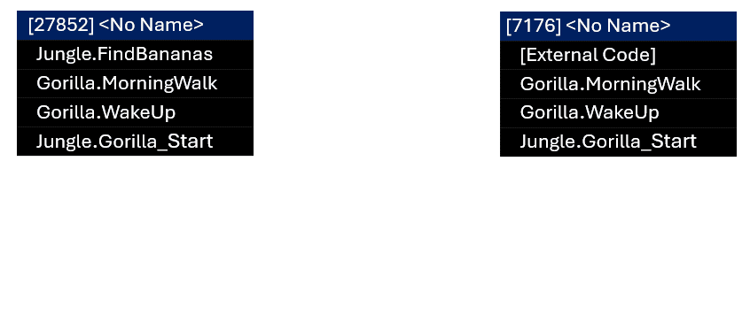
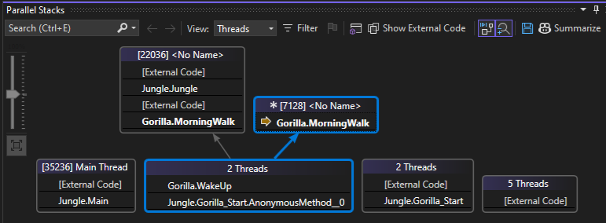

# Debug a deadlock using the Threads view

This tutorial shows how to use the **Threads** view of **Parallel Stacks** windows to debug a C# multithreaded application. This window helps you understand and verify the run-time behavior of multithreaded code.

The Threads view is also supported for C++ and Visual Basic, so the same principles described in this article for C# also apply to C++ and Visual Basic.

The Threads view helps you to:

- View call stack visualizations for multiple threads, which provides a more complete picture of your app state than the Call Stack window, which just shows the call stack for the current thread.

- Help identify issues such as blocked or deadlocked threads.

## C# sample

The sample code in this walkthrough is for an application that simulates a day in the life of a gorilla. The purpose of the exercise is to understand how to use the Threads view of the Parallel Stacks window to debug a multithreaded application.

The sample includes an example of a deadlock, which occurs when two threads are waiting on each other.

To make the call stack intuitive, the sample app performs the following sequential steps:

1. Creates an object representing a gorilla.
1. Gorilla wakes up.
1. Gorilla goes on a morning walk.
1. Gorilla finds bananas in the jungle.
1. Gorilla eats.
1. Gorilla engages in monkey business.

## Multithreaded call stacks

Identical sections of the call stack are grouped together to simplify the visualization for complex apps.

The following conceptual animation shows how grouping is applied to call stacks. Only identical segments of a call stack are grouped.



## Create the sample project

To create the project:

1. Open Visual Studio and create a new project.

   If the start window isn't open, choose **File** > **Start Window**.

   On the Start window, choose **New project**.

   On the **Create a new project** window, enter or type *console* in the search box. Next, choose **C#** from the Language list, and then choose **Windows** from the Platform list.

   After you apply the language and platform filters, choose the **Console App** for .NET, and then choose **Next**.

   > [!NOTE]
   > If you don't see the correct template, go to **Tools** > **Get Tools and Features...**, which opens the Visual Studio Installer. Choose the **.NET desktop development** workload, then choose **Modify**.

   In the **Configure your new project** window, type a name or use the default name in the **Project name** box. Then, choose **Next**.

   For .NET, choose either the recommended target framework or .NET 8, and then choose **Create**.

   A new console project appears. After the project has been created, a source file appears.

1. Open the *.cs* code file in the project. Delete its contents to create an empty code file.

1. Paste the following code for your chosen language into the empty code file.

   ```csharp
    using System.Diagnostics;
    
    namespace Multithreaded_Deadlock
    {
        class Jungle
        {
            public static readonly object tree = new object();
            public static readonly object banana_bunch = new object();
            public static Barrier barrier = new Barrier(2);
    
            public static int FindBananas()
            {
                // Lock tree first, then banana
                lock (tree)
                {
                    lock (banana_bunch)
                    {
                        Console.WriteLine("Got bananas.");
                        return 0;
                    }
                }
            }
    
            static void Gorilla_Start(object lockOrderObj)
            {
                Debugger.Break();
                bool lockTreeFirst = (bool)lockOrderObj;
                Gorilla koko = new Gorilla(lockTreeFirst);
                int result = 0;
                var done = new ManualResetEventSlim(false);
    
                Thread t = new Thread(() =>
                {
                    result = koko.WakeUp();
                    done.Set();
                });
                t.Start();
                done.Wait();
            }
    
            static void Main(string[] args)
            {
                List<Thread> threads = new List<Thread>();
                // Start two threads with opposite lock orders
                threads.Add(new Thread(Gorilla_Start));
                threads[0].Start(true);  // First gorilla locks tree then banana
                threads.Add(new Thread(Gorilla_Start));
                threads[1].Start(false); // Second gorilla locks banana then tree
    
                foreach (var t in threads)
                {
                    t.Join();
                }
            }
        }
    
        class Gorilla
        {
            private readonly bool lockTreeFirst;
    
            public Gorilla(bool lockTreeFirst)
            {
                this.lockTreeFirst = lockTreeFirst;
            }
    
            public int WakeUp()
            {
                int myResult = MorningWalk();
                return myResult;
            }
    
            public int MorningWalk()
            {
                Debugger.Break();
                if (lockTreeFirst)
                {
                    lock (Jungle.tree)
                    {
                        Jungle.barrier.SignalAndWait(5000); // For thread timing consistency in sample
                        Jungle.FindBananas();
                        GobbleUpBananas();
                    }
                }
                else
                {
                    lock (Jungle.banana_bunch)
                    {
                        Jungle.barrier.SignalAndWait(5000); // For thread timing consistency in sample
                        Jungle.FindBananas();
                        GobbleUpBananas();
                    }
                }
                return 0;
            }
    
            public void GobbleUpBananas()
            {
                Console.WriteLine("Trying to gobble up food...");
                DoSomeMonkeyBusiness();
            }
    
            public void DoSomeMonkeyBusiness()
            {
                Thread.Sleep(1000);
                Console.WriteLine("Monkey business done");
            }
        }
    }
   ```
   
   After you update the code file, save your changes and build the solution.

1. On the **File** menu, select **Save All**.

1. On the **Build** menu, select **Build Solution**.

## Use the Threads view of the Parallel Stacks window

To start debugging:

1. On the **Debug** menu, select **Start Debugging** (or **F5**) and wait for the first `Debugger.Break()` to be hit.

1. Press **F5** once, and the debugger pauses again on the same `Debugger.Break()` line.

   This pauses in the second call to `Gorilla_Start`, which occurs within a second thread.

   > [!TIP]
   > The debugger breaks into code on a per-thread basis. For example, this means that if you press **F5** to continue execution, and the app hits the next breakpoint, it may break into code on a different thread. If you need to manage this behavior for debugging purposes, you can add additional breakpoints, conditional breakpoints, or use **Break All**. For more information on using conditional breakpoints, see [Follow a single thread with conditional breakpoints](../debugger/get-started-debugging-multithreaded-apps.md#bkmk_follow_a_thread).

1. Select **Debug > Windows > Parallel Stacks** to open the Parallel Stacks window, and then select **Threads** from the **View** dropdown in the window.

   

   In **Threads** view, the stack frame and call path of the current thread are highlighted in blue. The current location of the thread is shown by the yellow arrow.

   Notice the label for the call stack for `Gorilla_Start` is **2 Threads**. When you last pressed **F5**, you started another thread. For simplification in complex apps, identical call stacks are grouped together into a single visual representation. This simplifies potentially complex information, especially in scenarios with many threads.

   During debugging, you can toggle whether external code is displayed. To toggle the feature, select or clear **Show External Code**. If you show external code, you can still use this walkthrough, but your results might differ from the illustrations.

1. Press **F5** again, and the debugger pauses in the `Debugger.Break()` line in the `MorningWalk` method.

   The Parallel Stacks window shows the location of the current executing thread in the `MorningWalk` method.

   

1. Hover over the `MorningWalk` method to get information about the two threads represented by the grouped call stack.

   :::image type="content" source="../debugger/media/vs-2022/debug-multithreaded-parallel-stacks-threads-view-threads.png" border="false" alt-text="Screenshot of the threads associated with the call stack." lightbox="../debugger/media/vs-2022/debug-multithreaded-parallel-stacks-threads-view-threads.png":::

   The current thread also appears in the **Thread** list in the Debug toolbar.

   

   You can use the **Thread** list to switch the debugger context to a different thread. This does not change the current executing thread, just the debugger context.

   Alternatively, you can switch the debugger context by double-clicking a method in the Threads view, or by right-clicking on a method in the Threads view and selecting **Switch to Frame** > **\[thread ID\]**.

1. Press **F5** again and the debugger pauses in the `MorningWalk` method for the second thread.

    

   Depending on the timing of thread execution, at this point you see either separate or grouped call stacks.
   
   In the preceding illustration, the call stacks for the two threads are partially grouped. The identical segments of the call stacks are grouped, and arrow lines point to the segments that are separated (that is, not identical). The current stack frame is indicated by the blue highlighting.

1. Press **F5** again, and you will see a long delay occur and the Threads view doesn't show any call stack information.

   The delay is caused by a deadlock. Nothing appears in the Threads view because even though threads may be blocked you aren't currently paused in the debugger.

   > [!TIP]
   > The **Break All** button is a good way to get call stack information if a deadlock occurs or all threads are currently blocked.

1. At the top of the IDE in the Debug toolbar, select the **Break All** button (pause icon), or use **Ctrl + Alt + Break**.

   :::image type="content" source="../debugger/media/vs-2022/debug-multithreaded-parallel-stacks-break-all.png" border="false" alt-text="Screenshot of Threads view after selecting Break All." lightbox="../debugger/media/vs-2022/debug-multithreaded-parallel-stacks-break-all.png":::
 
   The top of the call stack in the Threads view shows that `FindBananas` is deadlocked. The execution pointer in `FindBananas` is a curled green arrow, indicating the current debugger context but also it tells us that the threads are not currently running.

   In the code editor, we find the curled green arrow in the `lock` function. The two threads are blocked on the `lock` function in the `FindBananas` method.

   :::image type="content" source="../debugger/media/vs-2022/debug-multithreaded-parallel-stacks-break-all-editor.png" border="false" alt-text="Screenshot of code editor after selecting Break All." lightbox="../debugger/media/vs-2022/debug-multithreaded-parallel-stacks-break-all-editor.png":::

   Depending on the order of thread execution, the deadlock appears in either the `lock(tree)` or `lock(banana_bunch)` statement.

   The call to `lock` blocks the threads in the `FindBananas` method. One thread is waiting for the lock on `tree` to be released by the other thread, but the other thread is waiting for the lock on `banana_bunch` to be released before it can release the lock on `tree`. This is an example of a classic deadlock that occurs when two threads are waiting on each other.

   If you're using Copilot, you can also get AI-generated thread summaries to help identify potential deadlocks.

   :::image type="content" source="../debugger/media/vs-2022/debug-multithreaded-parallel-stacks-break-all-copilot.png" border="false" alt-text="Screenshot of Copilot thread summary descriptions." lightbox="../debugger/media/vs-2022/debug-multithreaded-parallel-stacks-break-all-copilot.png":::


## Fix the sample code

To fix this code, always acquire multiple locks in a consistent, global order across all threads. This prevents circular waits and eliminates deadlocks.

1. To fix the deadlock, replace the code in `MorningWalk` with the following code.

    ```csharp
    public int MorningWalk()
    {
        Debugger.Break();
        // Always lock tree first, then banana_bunch
        lock (Jungle.tree)
        {
            Jungle.barrier.SignalAndWait(5000); // OK to remove
            lock (Jungle.banana_bunch)
            {
                Jungle.FindBananas();
                GobbleUpBananas();
            }
        }
        return 0;
    }
    ```

2. Restart the app.

## Summary

This walkthrough demonstrated the **Parallel Stacks** debugger window. Use this window on real projects that use multithreaded code. You can examine parallel code written in C++, C#, or Visual Basic.

## Related content

- [Debugging Multithreaded Applications](../debugger/walkthrough-debugging-a-parallel-application.md)
- [First look at the debugger](../debugger/debugger-feature-tour.md)
- [Parallel Programming](/dotnet/standard/parallel-programming/index)
- [Concurrency Runtime](/cpp/parallel/concrt/concurrency-runtime)
- [Using the Parallel Stacks Window](../debugger/using-the-parallel-stacks-window.md)
