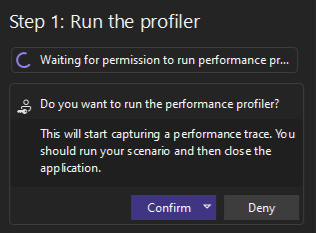
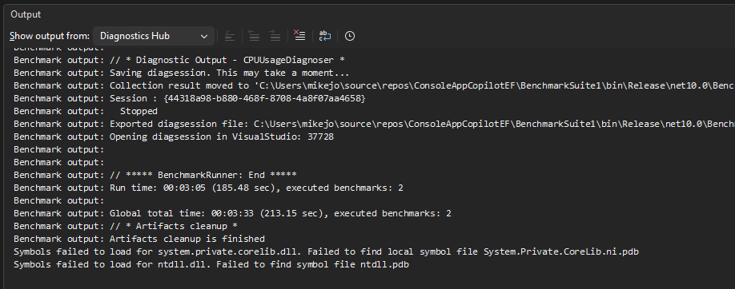
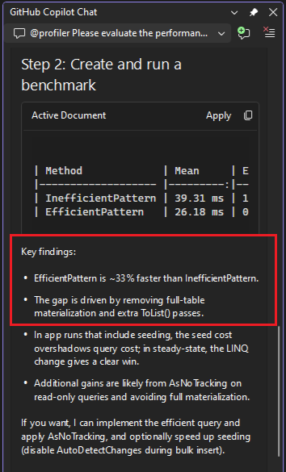
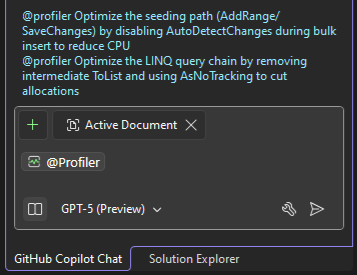

# Profile your app with GitHub Copilot

In this article, you'll learn how to profile applications and improve performance using Copilot and the Copilot Profiler Agent.

The Profiler Agent works alongside GitHub Copilot to:

- Analyze CPU usage, memory allocations, and runtime behavior.
- Surface performance bottlenecks.
- Generate [BenchmarkDotNet Benchmarks](https://benchmarkdotnet.org/articles/features/vsprofiler.html) or optimize existing BenchmarkDotNet benchmarks.
- Apply suggested optimizations.
- Validate improvements in a guided loop.

The Profiler Agent is especially helpful when:

- You're unfamiliar with profiling.
- You’re unsure where to start with performance tuning.
- You want to validate optimizations with real benchmarks.
- You’re working on high-performance apps like games, services, or client tools.

For general information about Copilot agents and agent mode, see [Use Copilot agent mode](../ide/copilot-agent-mode.md).

## Prerequisites

To get started, you need:

+ Visual Studio version 18.0.0 Preview 1 or later
+ [Sign in to Visual Studio using a GitHub account](../ide/work-with-github-accounts.md) with [Copilot access](https://docs.github.com/en/copilot/about-github-copilot/what-is-github-copilot#getting-access-to-copilot) <br/>
  <sup>**</sup> You can use [GitHub Copilot for Free](../ide/copilot-free-plan.md). Sign up and leverage AI to code faster and more efficiently.

## AI-enhanced scenarios

Copilot understands your code and the Visual Studio profiling tools. As a result, you can interact with the profiler-aware AI to ask detailed questions related to your code and to performance issues in general.

Copilot provides more precise help for some targeted scenarios, such as those described in the following table.

|Feature or scenario|Link|
|-|-|
|Agent-directed profiling for CPU usage|See [Profile using the Profiler Agent](#profile-using-the-copilot-profiler-agent) in this article.|
|Auto insights for profiling|See [Get AI assistance with Auto insights](../profiling/cpu-insights.md#get-ai-assistance).|
|Auto insights for instrumentation|See [Get AI assistance](../profiling/instrumentation.md#get-ai-assistance).|
|Auto insights for .NET Object Allocation|See [Get AI assistance](../profiling/dotnet-alloc-tool.md#get-ai-assistance).|
|Copilot tool suggestions|See Get AI Assistance section in [Overview of the profiling tools](../profiling/profiling-feature-tour.md)|

In some of these scenarios, you get targeted assistance by using the **Ask Copilot**  button. Copilot already knows the context for your questions. For example, it knows about insights discovered by the profiling tools and can make relevant suggestions how to fix them.

## Profile using the Copilot Profiler Agent

The following example shows how to collect performance data with the Copilot Profiler Agent, and then use it to analyze the results, and to suggest and make fixes.

### Start a profiling session

1. In Visual Studio, create a new C# Console app.

   On the start window, choose **Create a new project**. Type **console** in the search box, select **C#** as the language, and then choose **Console App** for .NET. Choose **Next**. Type a project name like **ConsoleApp_CopilotProfile** and select **Next**. Choose a target framework (for example, .NET 8) and choose **Create**.

1. In Solution Explorer, right-click the **Dependencies** node in the project, choose **Manage NuGet packages**, search for **EntityFramework**, and then add the following packages to the project:

   - Microsoft.EntityFramework.Core
   - Microsoft.EntityFramework.Core.InMemory

   The app uses an in-memory database to simplify the project setup.

1. Replace the code in *Program.cs* with the following code:

    ```csharp
    using System.Diagnostics;
    using Microsoft.EntityFrameworkCore;

    // Configure EF Core to use the InMemory provider
    var options = new DbContextOptionsBuilder<AppDbContext>()
        .UseInMemoryDatabase("PerfDemoDb")
        .Options;

    using var db = new AppDbContext(options);

    // Seed 100,000 records once
    if (!db.People.Any())
    {
        var rand = new Random(42);
        var cities = new[]
        {
            "Chicago", "Seattle", "Cairo", "London", "Paris",
            "Cleveland", "Calgary", "Dallas", "Berlin", "Copenhagen"
        };

        var people = Enumerable.Range(1, 100_000).Select(i => new Person
        {
            Name = $"Person {i}",
            Age = rand.Next(18, 80),
            City = cities[rand.Next(cities.Length)]
        });

        db.People.AddRange(people);
        db.SaveChanges();
    }

    Console.WriteLine($"Seeded records: {db.People.Count():N0}");

    // Inefficient LINQ pattern: materialize everything and repeatedly re-materialize + chain ToList
    // This simulates client-heavy work that doesn't scale, even with in-memory provider
    var sw = Stopwatch.StartNew();

    // Full materialization of all rows
    var all = db.People.ToList();

    // Extra ToList calls create multiple large intermediate lists
    var inefficient = all
        .Where(p => p.Age > 50)
        .ToList()
        .Where(p => p.City.StartsWith("C"))
        .ToList()
        .Select(p => p.Name)
        .Distinct()
        .OrderBy(n => n)
        .Take(10)
        .ToList();

    sw.Stop();
    Console.WriteLine($"Inefficient query returned {inefficient.Count} rows in {sw.ElapsedMilliseconds} ms");

    // EF Core entity
    public class Person
    {
        public int Id { get; set; }
        public string Name { get; set; } = string.Empty;
        public int Age { get; set; }
        public string City { get; set; } = string.Empty;
    }

    // EF Core DbContext
    public class AppDbContext : DbContext
    {
        public AppDbContext(DbContextOptions<AppDbContext> options) : base(options) { }
        public DbSet<Person> People => Set<Person>();
    }
    ```

1. Select **Build > Build Solution** to make sure the app builds without errors.

### Ask Copilot for profiling insights

1. Open the Copilot Chat window, and use the following prompt.

   ```@Profiler Please evaluate the performance of this code```

1. Select **Send**. 

   The `@Profiler` command calls the Copilot Profiler Agent. 

   

   Alternatively, you could start the profiler agent by manually choosing **Select Tools** and manually enabling the Profiler Agent, and then switching to agent mode. Using this method, you don't need to use the `@Profiler` command.

   Copilot asks if you want to run the profiler.

   

1. Choose **Confirm**.

   The agent runs through a series of steps independently. It examines the code, adds support to the project for BenchmarkDotNet, including project references and packages, adds benchmarks to a new file, and runs comparison test against new code that it generates.

   Benchmark results show up in the Output window, with the output set to **Diagnostics Hub**.

   

   Results from the diagnostics session appear in a *.diagsession* file report. If you want to manually investigate CPU usage, see [Analyze performance by using CPU profiling](../profiling/cpu-usage.md). However, in this scenario, we use the Profiler Agent instead.

   When finished testing, the agent summarizes its findings.

   The agent reports a potential 33% gain in efficiency, mainly by removing full-table materialization and an unnecessary `ToList()` method call.

   

   The agent also provides a couple of suggestions for next steps, including an option to optimize the LINQ query.

    

   For this example, you focus on optimizing the LINQ query.

1. Select the second Copilot suggestion and select **Send** to tell the agent to optimize the LINQ query chain.

   The agent updates **Program.cs** and provides additional suggestions to optimize code. We will skip those suggestions for now.

1. Take a look at code changes in **Program.cs**.

    

1. In the lower right of the code editor, examine the code changes and select **Keep** to keep them.

   The optimized query is shown here.

   ```csharp
    var optimized = db.People
        .AsNoTracking()
        .Where(p => p.Age > 50 && p.City.StartsWith("C"))
        .Select(p => p.Name)
        .Distinct()
        .OrderBy(n => n)
        .Take(10)
        .ToList();
   ```

1. If you want to agent to make additional optimizations, either select the suggestions provided by the agent or ask additional questions.

